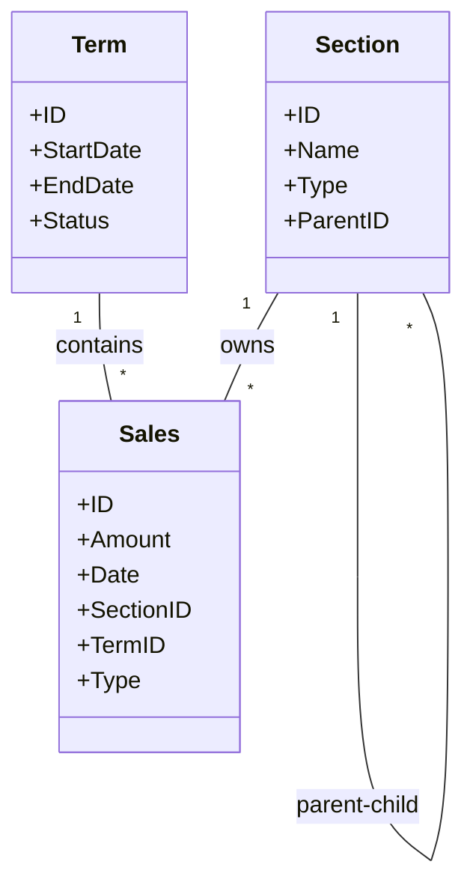

# Domain Model

## Entities

### Section
A unit of organization that Sales belong to.
- **Attributes**:
    - `ID`: Unique identifier.
    - `Name`: Name of the section (e.g., "Sales Dept 1", "Marketing").
    - `Type`: Department, Division, or Section.
    - `ParentID`: Reference to a parent section (for hierarchy).

### Term
A specific period for accounting.
- **Attributes**:
    - `ID`: Unique identifier.
    - `StartDate`: Start of the term.
    - `EndDate`: End of the term.
    - `Status`: Open, Closed.

### Sales
Represents a monetary transaction or revenue.
- **Attributes**:
    - `ID`: Unique identifier.
    - `Amount`: Monetary value (Money).
    - `Date`: Date of the transaction.
    - `SectionID`: The section this sale belongs to.
    - `TermID`: The term this sale falls under.
    - `Type`: Normal, Adjustment, Correction.

## Relationships

### Allocation
Sales can be allocated from one section to others.
- **Source**: Sales ID.
- **Targets**: List of (SectionID, Ratio/Amount).

### Hierarchy
Sections form a hierarchy (Department -> Division -> Section).

## Diagram

